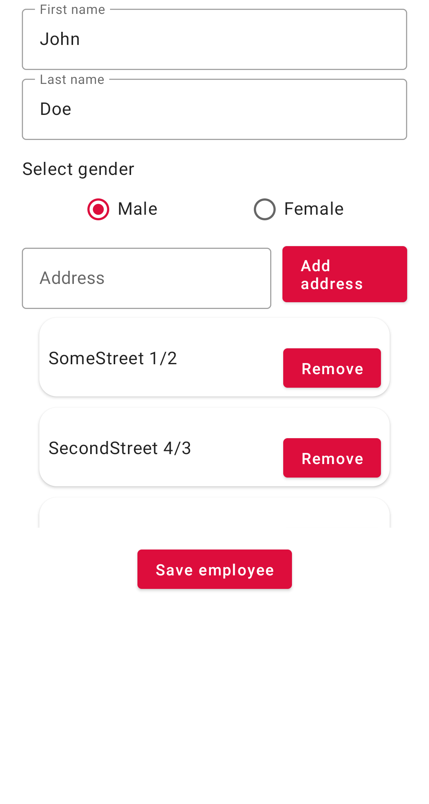

# AndroidMVIExample
Example Jetpack Compose Android App, that uses the newest mechanisms, like StateFlow, SharedFlow, etc. to manage states and handle events. ViewModel, UI and Screenshot tests included :)

  

## Architecture
- Clean Architecture
- Jetpack Compose
- MVI
- Flows

## Stack
- Kotlin
- Coroutines
- Architecture Components
    * Jetpack Compose
    * ViewModel
    * Room
    * Paging
- Koin (Dependency Injection)

## Firebase
- Analytics
- Crashlytics

## Testing
- Unit tests
    * ViewModel and Bussiness logic tests
    * Junit 4
    * Mockito-Kotlin
    * Google Truth
- UI tests
    * Using createComposeRule for composable tests
    * Robot pattern
- Screenshot tests
    * node.captureToImage().asAndroidBitmap() for taking composables screenshots
    * Custom gradle tasks for pulling screenshots from the device
    * **Run UI tests on Android Emulator API 30 without Google Play! (Google APIs is OK)**

# License

    Copyright 2021 Patryk Marciszek-Kosieradzki

    Licensed under the Apache License, Version 2.0 (the "License");

    you may not use this file except in compliance with the License.

    You may obtain a copy of the License at

       http://www.apache.org/licenses/LICENSE-2.0

    Unless required by applicable law or agreed to in writing, software

    distributed under the License is distributed on an "AS IS" BASIS,

    WITHOUT WARRANTIES OR CONDITIONS OF ANY KIND, either express or implied.

    See the License for the specific language governing permissions and

    limitations under the License.
